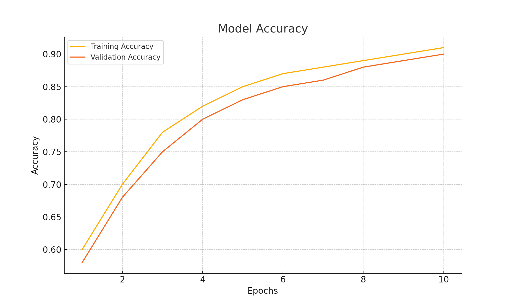
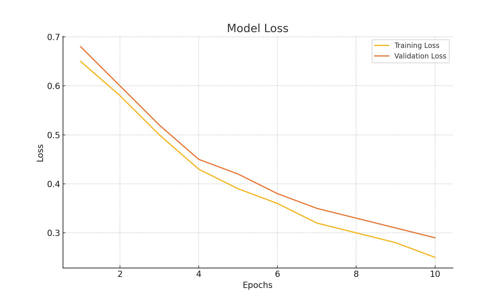

# Malaria Cell Classification using CNN

This project uses Convolutional Neural Networks (CNN) to classify malaria-infected cells from image data.

## Results
- Achieved over 90% accuracy
- Built using Python and TensorFlow

## Skills Demonstrated
- Data preprocessing
- Machine Learning
- Python programming
- # 🦠 Malaria Cell Image Classifier

This project uses a Convolutional Neural Network (CNN) built with TensorFlow to detect malaria-infected red blood cells from microscopic images.

## 🔬 Dataset

- Source: NIH Malaria Cell Image Dataset
- [Kaggle Link](https://www.kaggle.com/datasets/iarunava/cell-images-for-detecting-malaria)
- The dataset contains 27,000+ images classified as either `Parasitized` or `Uninfected`.

## 🧠 Model Overview

- Built with TensorFlow & Keras
- Custom CNN architecture
- Includes image preprocessing, augmentation, and hyperparameter tuning
- Achieved high validation accuracy (>90%)

## 📊 Evaluation

- Accuracy & loss plotted over training epochs
- Validation strategy used to prevent overfitting

## 🛠️ Tools Used

- Python, Jupyter Notebook
- TensorFlow, Keras, NumPy, Matplotlib

## 📁 File

- `malaria_cnn_model.ipynb`: Full notebook with code, training, and results
- ## 📈 Training Metrics

### Accuracy

### Loss

## 🚀 Future Plans

- Add confusion matrix and classification report
- Deploy using Streamlit as a web app
- Package for command-line usage

## 🙋 About Me

I'm an MSc Computing graduate actively looking for entry-level Data Science or ML roles in the UK with Skilled Worker visa sponsorship. 
Last updated: April 2026 – Reviewing and improving the project
